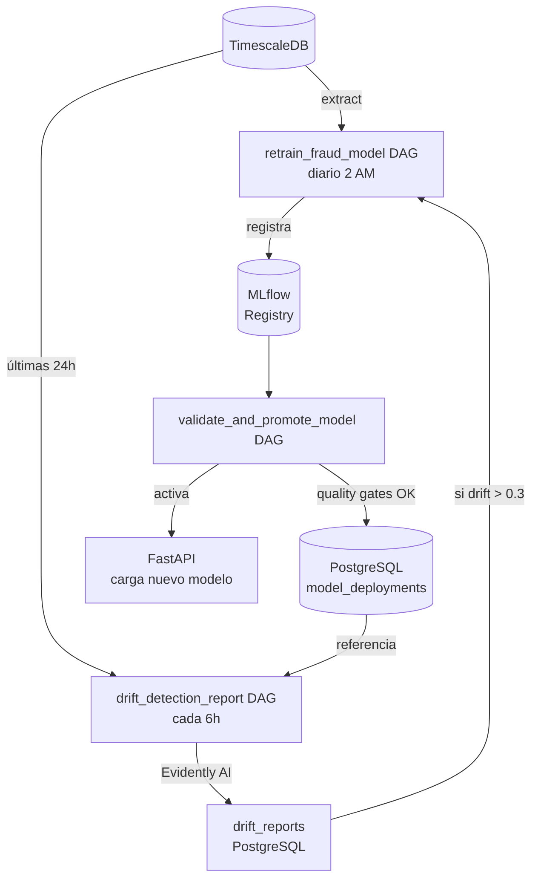
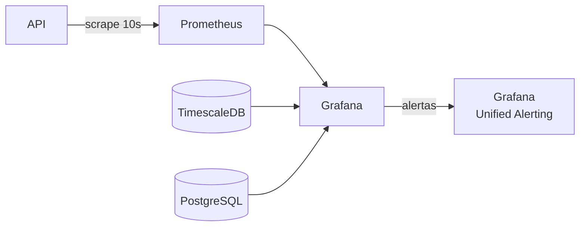

# Arquitectura del Sistema

## Flujo de datos

### Pipeline en tiempo real

```mermaid
flowchart LR
    SIM[Simulador\nProducer] -->|Avro| RAW[transactions.raw]
    RAW --> FE[Feature Engineering\nConsumer]
    FE -->|ventanas 1h/24h/7d| REDIS[(Redis\ncaché estado)]
    FE -->|inserta| TSDB[(TimescaleDB\nhypertable)]
    FE -->|Avro| FEAT[transactions.features]
    FEAT --> IC[Inference\nConsumer]
    IC -->|POST /predict| API[FastAPI\nXGBoost]
    API -->|async| PG[(PostgreSQL\npredicciones)]
    IC -->|Avro| PRED[transactions.predictions]
    IC -->|si fraude| ALERTS[transactions.fraud.alerts]
    API --> METRICS[/metrics\nPrometheus]
```

### Pipeline MLOps (batch)



### Monitoreo



## Descripción de capas

### Ingesta y streaming (Kafka)

El cluster Kafka tiene cuatro topics con schemas Avro registrados en Schema Registry:

| Topic | Productores | Consumidores | Particiones | Retención |
|---|---|---|---|---|
| `transactions.raw` | Producer (simulador) | Consumer (feature eng.) | 3 | 7 días |
| `transactions.features` | Consumer | Inference Consumer | 3 | 7 días |
| `transactions.predictions` | Inference Consumer | — (auditoría) | 3 | 7 días |
| `transactions.fraud.alerts` | Inference Consumer | — (alertas externas) | 1 | 30 días |

### Feature Engineering Online

El `Consumer` (group id: `fraud-feature-engineering`) procesa cada mensaje de `transactions.raw` en el mismo orden en que llegó. Por cada transacción:

1. **`SlidingWindowStore`**: calcula features de ventana temporal sin tocar la base de datos — mantiene el historial en memoria y evicta entradas > 7 días. Produce `tx_count_1h/24h/7d`, `amount_sum_1h/24h`, `seconds_since_last_tx`.
2. **`HistoricalProfileStore`**: calcula features del perfil histórico del usuario — `amount_ratio_vs_user_avg`, `is_country_new`, `is_merchant_new`, `distinct_countries_seen/merchants_seen`.
3. **Redis**: persiste el estado de ambos stores para sobrevivir reinicios. Opera con circuit breaker: si Redis no está disponible, el consumer continúa en modo degradado (estado en memoria solamente).
4. **`TimescaleWriter`**: inserta la transacción enriquecida en TimescaleDB con `ON CONFLICT DO NOTHING` (idempotente).
5. **`FeaturePublisher`**: serializa con Avro y publica en `transactions.features`.

### Serving (FastAPI)

La API carga el modelo XGBoost en Production desde MLflow Registry al startup (`ModelLoader.load()`). Para cada request de predicción:

1. `prepare_features()` construye un array numpy `(1, 16)` en el orden exacto de `SELECTED_FEATURES`.
2. `predict_proba()` corre en < 5ms para una sola transacción.
3. La respuesta se devuelve inmediatamente; el guardado en PostgreSQL ocurre en background task (asyncpg, no bloquea la respuesta).
4. `PredictionCache` (Redis) garantiza idempotencia: el mismo `transaction_id` devuelve el mismo resultado sin re-inferir.
5. `prometheus-fastapi-instrumentator` expone métricas HTTP estándar en `/metrics` (contadores, histogramas de latencia por endpoint).

### Bases de datos

**TimescaleDB** almacena las transacciones con particionado automático por tiempo:

- Hypertable `transactions`: chunk de 1 día, 3 índices optimizados (user+timestamp, timestamp, is_fraud parcial).
- Continuous aggregate `fraud_volume_hourly`: pre-calcula tasa de fraude por hora — actualizado cada 5 minutos. Usado directamente por los dashboards de Grafana.
- Continuous aggregate `merchant_amount_daily`: monto total por merchant por día.
- Política de compresión: datos > 7 días.

**PostgreSQL** actúa como cerebro del sistema MLOps:

- `model_deployments`: versiones de modelo con métricas de entrenamiento e indicador `is_active`.
- `predictions_history`: predicción por transacción con `latency_ms` y `deployment_id` (FK).
- `drift_reports`: reportes de Evidently con `drift_score` global y `feature_drifts` JSONB (drill-down por feature).
- `alert_log`: alertas del sistema con severidad y timestamp de acknowledgment.
- `audit_log`: trigger genérico que registra toda modificación a `model_deployments` y `predictions_history`.
- Stored procedure `activate_model_version(id)`: desactiva todas las versiones anteriores y activa la nueva en una transacción atómica.

### MLOps

**MLflow** usa PostgreSQL como backend store y un volumen Docker como artifact store. Los artefactos de cada run incluyen: `xgboost_model.joblib`, `categorical_encoder.joblib`, feature importance plot, confusion matrix, ROC curve, y el reporte HTML de Evidently.

**Airflow** corre con LocalExecutor (suficiente para el volumen de DAGs en un entorno single-node). Los 4 DAGs usan la TaskFlow API (`@task`) para tipado explícito de XComs.

**Evidently AI** (v0.4.x) genera reportes de `DataDriftPreset` comparando las features de producción de las últimas 24h contra el dataset de referencia del último entrenamiento. El threshold de reentrenamiento automático (`DRIFT_THRESHOLD_CRITICAL = 0.20`) es configurable vía variable de entorno.

### Monitoreo (Grafana + Prometheus)

Grafana provisiona automáticamente 3 datasources (TimescaleDB, PostgreSQL, Prometheus) y 4 dashboards desde archivos YAML/JSON en la imagen Docker. Los archivos se copian a `/etc/grafana/dashboards/` (no a `/var/lib/grafana/` que es sobreescrita por el volumen nombrado).

Las 4 alertas de Grafana Unified Alerting usan el pipeline A → B → C: A (query al datasource con `relativeTimeRange`) → B (reduce: last value) → C (threshold).

## Decisiones de diseño

### TimescaleDB + PostgreSQL vs una sola base de datos

Se usaron dos bases de datos diferentes para separar patrones de acceso incompatibles:

- TimescaleDB para el stream de transacciones: escrituras de alta frecuencia con timestamp, queries temporales con funciones propias (`time_bucket`, continuous aggregates, chunk pruning). PostgreSQL estándar no tiene estas optimizaciones.
- PostgreSQL para metadata MLOps: datos relacionales, transacciones ACID, stored procedures, triggers de auditoría. TimescaleDB hereda todas las capacidades de PostgreSQL, pero las extensiones de serie temporal no agregan valor aquí.

### Redis con circuit breaker en el Consumer

Redis es el caché del estado de usuario (ventanas deslizantes + perfil histórico). Si Redis falla, el Consumer podría bloquearse. El circuit breaker resuelve esto: el Consumer detecta la indisponibilidad, opera en modo degradado (estado solo en memoria), y reconecta automáticamente cuando Redis se recupera. El costo: si el Consumer se reinicia mientras Redis está caído, se pierde el estado en memoria y las primeras transacciones de cada usuario se calculan como si fuera usuario nuevo.

### Migraciones SQL puras vs Alembic

Alembic fue considerado pero descartado: las hypertables de TimescaleDB (`create_hypertable`), los continuous aggregates con refresh policy, y los triggers de auditoría PL/pgSQL son construcciones que Alembic no genera automáticamente y que requerirían operaciones manuales de todas formas. Con SQL puro versionado se tiene control total y las migraciones son legibles y auditables directamente.

### Provisioning de Grafana a `/etc/grafana/dashboards/`

Los dashboards se copian a `/etc/grafana/dashboards/` y no a `/var/lib/grafana/dashboards/`. El motivo: el volumen nombrado `grafana-data` monta en `/var/lib/grafana`, y Docker monta el volumen después de construir la imagen — el contenido previo de ese path en la imagen queda oculto. `/etc/grafana/` no está cubierto por ningún volumen, por lo que el `COPY` del Dockerfile persiste.

### `uv` como gestor de dependencias

El proyecto usa `uv` con grupos de dependencias en `pyproject.toml` en lugar de múltiples `requirements/*.txt`. Cada imagen Docker instala solo el grupo que necesita (`--group serving`, `--group consumer`, etc.), lo que reduce el tamaño de las imágenes y elimina conflictos entre servicios. El lockfile `uv.lock` garantiza reproducibilidad exacta en CI.
